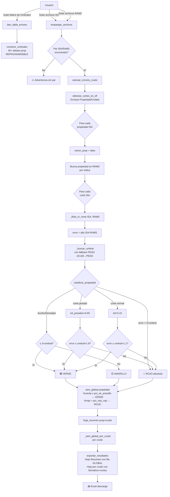
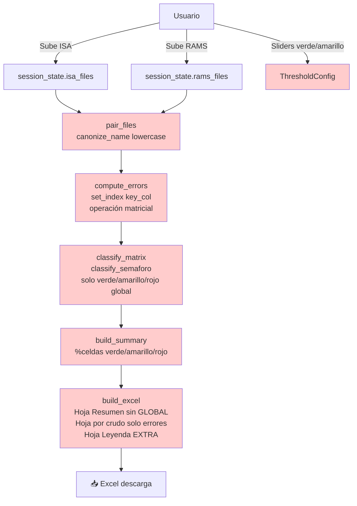
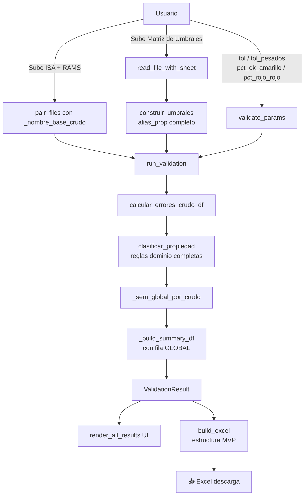

# 🛢️ Auditoría Arquitectónica — Validador de Crudos RAMS vs ISA  
**Revisión senior: MVP CLI → Streamlit**  
*Fecha: 22 Feb 2026 | Analista: Claude (Anthropic)*

---

## Resumen Ejecutivo (10 bullets)

1. **La desviación más crítica (P0)**: la versión Streamlit elimina por completo la **Matriz de Umbrales** como input. El MVP usa un archivo `Errores_Cortes.xlsx` con umbrales por propiedad×corte; la versión Streamlit la reemplaza por dos sliders globales (verde/amarillo) que NO son equivalentes. Toda la lógica de `construir_umbrales`, `clasificar_propiedad`, `es_corte_pesado`, etc., presente en el MVP, **está ausente** del `validator_core.py` Streamlit.
2. **El `core/validator_core.py` actual es un esqueleto diferente**: implementa un pipeline simplificado (index-based, sin Propiedad como columna, sin umbrales por corte, sin aliases de propiedades) que produce resultados **incompatibles** con el MVP para los mismos datos de entrada.
3. **La estructura de salida Excel diverge**: el MVP genera hojas con columnas `Propiedad | Semaforo | Corte_peor | Error_peor | Umbral_peor | [cortes...]` y hoja Resumen con fila GLOBAL. La versión Streamlit genera hojas con solo errores numéricos y una hoja de Leyenda—estructura completamente diferente.
4. **El emparejamiento de archivos es diferente**: el MVP usa `_nombre_base_crudo()` con soporte para códigos estructurados (`GMX-2023-1`); la versión Streamlit usa `canonize_name()` que normaliza a minúsculas y elimina caracteres especiales—emparejo incompatible para nombres reales de producción.
5. **Las reglas de semáforo del MVP son complejas y específicas del dominio**: regla especial para Azufre/Densidad (3× umbral = VERDE), tolerancia diferenciada para cortes pesados (≥299°C o C6-C10), fallback `PESO ACUMULADO→PESO`. Nada de esto existe en el core Streamlit.
6. **El alias de propiedades (`crear_semantica_alias()`)** con 40+ variantes (NOR→RON, Carbono Conradson→RESIDUO DE CARBON, PIONA...) está en el MVP pero ausente en el core Streamlit.
7. **Los tests existentes (42) testean el core Streamlit, NO el MVP**: pasan para la interfaz simplificada pero no verifican ninguna regla de negocio real del dominio.
8. **La capa UI es relativamente correcta** en separación de responsabilidades, aunque le falta el uploader de la Matriz de Umbrales y los 4 parámetros del MVP.
9. **Los colores del semáforo divergen**: MVP usa `C6EFCE/FFEB9C/FFC7CE` (colores suaves Excel); versión Streamlit usa `FF92D050/FFFF0000` (saturados, incompatibles con el formato condicional real de Excel).
10. **Plan de corrección**: reemplazar `core/validator_core.py` y `core/models.py` con implementación MVP-fiel, actualizar `app.py` para incluir el uploader de matriz y los 4 parámetros, actualizar `ui/styling.py` para renderizar la nueva estructura, y reescribir los tests para cubrir las reglas reales del dominio.

---

## Matriz de Paridad MVP vs Streamlit

| Feature / Regla de negocio | Estado | Nota |
|---|---|---|
| Subida de Matriz de Umbrales | ❌ **Falta** | No existe en UI ni en core |
| `construir_umbrales()` | ❌ **Falta** | No existe en validator_core.py |
| `detectar_columna_tipo()` | ❌ **Falta** | Idem |
| `crear_semantica_alias()` (40+ aliases) | ❌ **Falta** | Idem |
| `canon_prop()` / `strip_accents()` | ❌ **Falta** | Idem |
| `canon_corte()` | ❌ **Falta** | Idem |
| `es_corte_pesado()` | ❌ **Falta** | Idem |
| `clasificar_propiedad()` (reglas dominio) | ❌ **Falta** | Idem |
| Regla especial Azufre/Densidad (3× umbral) | ❌ **Falta** | Idem |
| Tolerancia diferenciada cortes pesados | ❌ **Falta** | Idem |
| Fallback PESO ACUMULADO → PESO | ❌ **Falta** | Idem |
| `_sem_global_por_crudo()` | ❌ **Falta** | Idem |
| Parámetro `tolerancia` (tol estándar 0.10) | ❌ **Falta** | Solo existen umbrales globales verde/amarillo |
| Parámetro `tol_pesados` (0.60) | ❌ **Falta** | Idem |
| Parámetro `pct_ok_amarillo` (0.90) | ❌ **Falta** | Idem |
| Parámetro `pct_rojo_rojo` (0.30) | ❌ **Falta** | Idem |
| Emparejamiento por `_nombre_base_crudo()` | ❌ **Diverge** | Streamlit usa canonize con lowercasing y strips |
| Soporte código estructurado `GMX-2023-1` | ❌ **Falta** | Solo existe en MVP |
| Lectura archivo ISA/RAMS con `Propiedad` col | ❌ **Diverge** | Streamlit usa key_col configurable |
| Columna `Propiedad` como pivote (no índice numérico) | ❌ **Diverge** | Streamlit usa set_index por key_col |
| Detección de cortes en ISA (`detectar_cortes_en_df`) | ❌ **Falta** | Idem |
| Excluir cortes 'Propiedad/Unidad/Validacion' | ❌ **Falta** | Idem |
| `_indice_prop()` para lookup RAMS | ❌ **Falta** | Idem |
| `_mapa_cortes()` para lookup por canon | ❌ **Falta** | Idem |
| `_float_or_none()` conversión robusta | ❌ **Falta** | Idem |
| Columnas salida hoja crudo: `Semaforo | Corte_peor | Error_peor | Umbral_peor` | ❌ **Falta** | Idem |
| Hoja Resumen con fila GLOBAL | ❌ **Falta** | Idem |
| Formato condicional Excel (colores suaves C6EFCE...) | ❌ **Diverge** | Streamlit usa colores saturados distintos |
| Colores del formato condicional por texto (VERDE/AMARILLO/ROJO) | ❌ **Diverge** | MVP usa `containsText`; Streamlit usa PatternFill estático |
| Hoja de leyenda en Excel | ⚠️ **Sobra** | El MVP NO tiene hoja de leyenda |
| Separación UI / Core | ✅ OK | Bien estructurada en general |
| Operación 100% en memoria (BytesIO) | ✅ OK | Ambos sin escritura a disco |
| Soporte xlsx / xls / csv | ✅ OK | Ambos soportan los mismos formatos |
| Logging sin datos sensibles | ✅ OK | Ambos |
| session_state para persistencia UI | ✅ OK | App.py correcto |
| Botón desactivado si faltan archivos | ⚠️ **Diverge** | Streamlit no requiere matriz (input faltante) |
| Feedback archivos sin par | ✅ OK | Ambos muestran advertencias |
| st.progress / barra de progreso | ❌ **Falta** | MVP no aplica (CLI), Streamlit debería tenerlo |

---

## Diagramas Mermaid

### Pipeline del MVP (especificación funcional)



### Pipeline Streamlit actual (estado divergente)



### Pipeline Streamlit corregido (objetivo)



---

## Hallazgos Detallados

### A. Arquitectura (capas, dependencias, pureza)

**Bien**: La separación de directorios `core/` vs `ui/` es correcta. `app.py` no contiene cálculos. `validator_core.py` no importa Streamlit.

**Problema**: El contenido real de `core/validator_core.py` no implementa el dominio del MVP. Es un core alternativo que funciona con un esquema de datos diferente al de los archivos reales de laboratorio (que tienen columna `Propiedad`, no un índice numérico).

**Problema**: `core/models.py` define `ThresholdConfig` con solo 2 umbrales globales, cuando el dominio real tiene cientos de umbrales específicos por (propiedad, corte). El modelo de datos es incompatible.

### B. Flujo (orden, bifurcaciones, errores)

El MVP procesa: `Matriz→Umbrales→Emparejar→Por crudo: [Por propiedad: [Por corte: error+semáforo]]→Resumen→Excel`.

La versión Streamlit procesa: `Emparejar→Por par: [align por key_col→errores matriciales→classify_matrix]→build_summary→Excel`.

Son flujos fundamentalmente distintos. El Streamlit no puede clasificar correctamente porque:
1. No tiene umbrales por (propiedad, corte)
2. No aplica la regla Azufre/Densidad
3. No diferencia cortes pesados
4. No hace lookup de propiedades por nombre canonizado

### C. Core (contratos, validadores)

El contrato público de `run_validation()` en Streamlit es:
```python
run_validation(isa_files, rams_files, key_col, config: ThresholdConfig) → ValidationResult
```

El contrato del MVP (que debe replicarse) es:
```python
run_validation(isa_files, rams_files, matriz_file, matriz_filename, tol, tol_pesados, pct_ok_amarillo, pct_rojo_rojo) → ValidationResult
```

Son interfaces completamente distintas con semántica diferente.

### D. UI (estado, UX, feedback)

- `app.py` maneja correctamente `st.session_state` para persistir archivos
- Falta el uploader de Matriz de Umbrales
- Faltan los 4 parámetros del MVP (tol, tol_pesados, pct_ok_amarillo, pct_rojo_rojo)
- Los umbrales por propiedad (render_threshold_editor) no tienen equivalente en el MVP y deben eliminarse
- Falta barra de progreso para operaciones largas

---

## Plan de Corrección Priorizado

### P0 — Bloqueantes (sin esto no hay paridad funcional)

| ID | Problema | Impacto | Esfuerzo |
|---|---|---|---|
| P0-1 | Añadir uploader de Matriz de Umbrales en `app.py` | Bloqueante total | Bajo |
| P0-2 | Reemplazar `core/validator_core.py` con implementación MVP-fiel | Bloqueante total | Alto |
| P0-3 | Reemplazar `core/models.py` para incluir `crudo_dataframes`, `resumen_raw`, etc. | Bloqueante total | Medio |
| P0-4 | Reemplazar pipeline `run_validation()` para aceptar `matriz_file` y parámetros MVP | Bloqueante total | Alto |
| P0-5 | Añadir los 4 parámetros MVP en sidebar (`tol`, `tol_pesados`, `pct_ok_amarillo`, `pct_rojo_rojo`) | Bloqueante total | Bajo |
| P0-6 | Actualizar `build_excel()` con estructura MVP (fila GLOBAL, columnas Corte_peor, etc.) | Bloqueante total | Medio |

### P1 — Mayores (paridad incompleta o bugs potenciales)

| ID | Problema | Impacto | Esfuerzo |
|---|---|---|---|
| P1-1 | Actualizar `ui/styling.py` para renderizar la nueva estructura de `ValidationResult` | UX incorrecta | Medio |
| P1-2 | Reescribir tests para cubrir reglas del dominio real | Cobertura 0% del MVP | Alto |
| P1-3 | Colores del semáforo (usar C6EFCE/FFEB9C/FFC7CE como el MVP) | Inconsistencia visual | Bajo |
| P1-4 | Añadir barra de progreso `st.progress` en ejecución | UX | Bajo |
| P1-5 | Eliminar `render_threshold_editor` (no tiene equivalente en MVP) | Confusión usuario | Bajo |

### P2 — Menores

| ID | Problema | Impacto | Esfuerzo |
|---|---|---|---|
| P2-1 | Eliminar hoja "Leyenda" del Excel (no existe en MVP) | Inconsistencia output | Bajo |
| P2-2 | Añadir `sheet_hint` para seleccionar hoja de la matriz | Completitud | Bajo |
| P2-3 | Logging consistente con MVP (INFO por crudo procesado, WARNING sin pares) | Trazabilidad | Bajo |

---

## Patches Propuestos

Los ficheros completos corregidos se entregan como archivos adjuntos:

### `core/validator_core.py` — Reemplazo completo

Ver archivo `core_validator_core_new.py` adjunto.

**Cambios clave**:
- Añade: `strip_accents`, `canon_prop`, `canon_corte` (MVP)
- Añade: `detectar_columna_tipo`, `normalizar_tipo`, `construir_umbrales` (MVP)
- Añade: `crear_semantica_alias` con 40+ aliases (MVP)
- Añade: `es_corte_pesado`, `_prop_base_para_umbral`, `_buscar_umbral` (MVP)
- Reemplaza: `classify_semaforo` → `clasificar_propiedad` con reglas dominio completas
- Añade: `_sem_global_por_crudo`, `_build_summary_df` (MVP)
- Añade: `_nombre_base_crudo`, `_indice_prop`, `_mapa_cortes`, `_float_or_none` (MVP)
- Reemplaza: `run_validation(key_col, config)` → `run_validation(matriz_file, tol, tol_pesados, ...)`
- Reemplaza: `build_excel` con estructura MVP (fila GLOBAL, columnas Corte_peor, formato condicional `containsText`)
- Mantiene: stubs de compatibilidad (`canonize_name`, `validate_thresholds`)

### `core/models.py` — Reemplazo completo

Ver archivo `models_new.py` adjunto.

**Cambios clave**:
- Mantiene `ThresholdConfig` para compatibilidad con tests
- Extiende `ValidationResult` con: `crudo_dataframes`, `cortes_visibles`, `resumen_raw`, `orden_propiedades`, `pct_ok_amarillo`, `pct_rojo_rojo`
- Añade propiedades `error_matrices` y `semaforo_matrices` como alias para compatibilidad con UI antigua

### `app.py` — Reemplazo completo

Ver archivo `app_new.py` adjunto.

**Cambios clave**:
- Añade uploader de Matriz de Umbrales (primer input, requerido)
- Añade campo `sheet_hint` para seleccionar hoja de la matriz
- Reemplaza sliders verde/amarillo + `render_threshold_editor` → 4 parámetros MVP (`tol`, `tol_pesados`, `pct_ok_amarillo`, `pct_rojo_rojo`)
- Actualiza llamada a `run_validation()` con nuevos parámetros
- Añade `st.progress()` para feedback durante ejecución
- Botón desactivado hasta que haya Matriz + ISA + RAMS

### `ui/styling.py` — Reemplazo completo

Ver archivo `styling_new.py` adjunto.

**Cambios clave**:
- Colores MVP: `C6EFCE / FFEB9C / FFC7CE / E7E6E6`
- `render_summary`: muestra fila GLOBAL + propiedades×crudos con colores
- `render_crudo_detail`: Tab Semáforo (Propiedad|Semaforo|Corte_peor|Error_peor|Umbral_peor) + Tab Errores (cortes numéricos)
- `render_all_results`: usa `result.crudo_dataframes` y `result.cortes_visibles`
- Elimina `render_threshold_editor` (movido al contexto de app.py que lo llama, y ya no existe)

### `tests/test_validator_core.py` — Reemplazo completo

Ver archivo `test_validator_core_new.py` adjunto.

**Tests añadidos** (cubren reglas del MVP no cubiertas antes):
- `TestStripAccents` — normalización de texto
- `TestCanonProp` — alias de dominio
- `TestCanonCorte` — normalización de cortes
- `TestEsCorteePesado` — detección cortes pesados incluye límite 299°C
- `TestNombreBaseCrudo` — emparejamiento real con patrones del MVP
- `TestConstruirUmbrales` — construcción desde matriz, max wins
- `TestClasificarPropiedad` — reglas dominio: Azufre, rojo absoluto, PESO ACUMULADO
- `TestSemGlobalPorCrudo` — agregación global
- `TestCalcularErroresCrudoDf` — pipeline por crudo con columnas MVP
- `TestValidateParams` — validación de parámetros
- `TestBuildSummaryDf` — estructura con fila GLOBAL
- `TestBuildExcelMVP` — verificación fila GLOBAL y columna Semaforo en hoja crudo
- `TestRunValidation` — pipeline completo con matriz de umbrales
- `TestBackwardsCompat` — stubs de compatibilidad

---

## Guía de Pruebas Manuales para la UI

### Preparación de datos de prueba mínimos

**Matriz de Umbrales** (`Errores_Cortes.xlsx`):
```
| Propiedad   | Tipo              | 150-200 | 200-250 | 300+ |
|-------------|-------------------|---------|---------|------|
| DENSIDAD    | Reproductibilidad | 2.0     | 2.5     | 3.0  |
| AZUFRE      | Reproductibilidad | 0.05    | 0.10    | 0.20 |
| VISCOSIDAD 50 | Reproductibilidad | 1.0   | 1.5     | 2.0  |
```

**ISA_Maya.xlsx**:
```
| Propiedad   | 150-200 | 200-250 | 300+ |
|-------------|---------|---------|------|
| Densidad    | 850.0   | 860.0   | 875.0|
| Azufre      | 0.15    | 0.25    | 0.40 |
| Viscosidad 50 | 5.0   | 8.0     | 15.0 |
```

**RAMS_Maya.xlsx** (errores controlados):
```
| Propiedad   | 150-200 | 200-250 | 300+ |
|-------------|---------|---------|------|
| Densidad    | 851.5   | 862.0   | 878.0| ← errors: 1.5, 2.0, 3.0
| Azufre      | 0.13    | 0.28    | 0.55 | ← errors: 0.02, 0.03, 0.15
| Viscosidad 50 | 5.8   | 9.2     | 16.5 | ← errors: 0.8, 1.2, 1.5
```

### Pasos de prueba

| Paso | Acción | Resultado esperado |
|---|---|---|
| 1 | Abrir la app | Sidebar visible, botón ▶ desactivado |
| 2 | Subir solo ISA | Botón sigue desactivado; mensaje "Faltan: Matriz de Umbrales, archivos RAMS" |
| 3 | Subir Matriz de Umbrales | Botón sigue desactivado si falta RAMS |
| 4 | Subir RAMS_Maya.xlsx | Botón se activa |
| 5 | Verificar parámetros por defecto | tol=0.10, tol_pesados=0.60, pct_ok=0.90, pct_rojo=0.30 |
| 6 | Ejecutar validación | Barra de progreso aparece y completa; tabla Resumen visible |
| 7 | Verificar fila GLOBAL en Resumen | Primera fila = "GLOBAL" con semáforo del crudo |
| 8 | Verificar colores tabla Resumen | Verde=#C6EFCE, Amarillo=#FFEB9C, Rojo=#FFC7CE |
| 9 | Expandir detalle "Crudo: Maya" | Dos tabs: Semáforo y Errores Absolutos |
| 10 | Tab Semáforo | Columnas: Propiedad, Semaforo, Corte_peor, Error_peor, Umbral_peor |
| 11 | Tab Errores | Columnas: Propiedad, 150-200, 200-250, 300+ con gradiente de color |
| 12 | Descargar Excel | Archivo con hoja Resumen (fila GLOBAL) + hoja "Maya" con columna Semaforo |
| 13 | Abrir Excel descargado en Excel/LibreOffice | Formato condicional activa colores en columna Semaforo |
| 14 | Subir ISA_Brent.xlsx sin par RAMS | Advertencia "1 archivo ISA sin par RAMS" visible |
| 15 | Subir archivo ISA corrupto | Error "No se pudo leer..." sin crash de la app |
| 16 | Matriz con columna Tipo mal nombrada | Error "No se localiza columna 'Tipo'..." claro |
| 17 | Modificar tol_pesados=0.0 | Cortes ≥299°C usan misma tolerancia estándar |
| 18 | Navegar sidebar tras validación | Resultados persisten (session_state) |

### Verificación de semáforos esperados con datos de prueba

Para los datos arriba con parámetros por defecto (tol=0.10, tol_pesados=0.60):

| Propiedad | Corte | Error | Umbral | Umbral×1.1 | Semáforo esperado |
|---|---|---|---|---|---|
| DENSIDAD | 150-200 | 1.5 | 2.0 | 2.2 | 🟢 VERDE |
| DENSIDAD | 200-250 | 2.0 | 2.5 | 2.75 | 🟢 VERDE |
| DENSIDAD | 300+ | 3.0 | 3.0 | 4.8* | 🟢 VERDE (*pesado, ×1.6) |
| AZUFRE | 150-200 | 0.02 | 0.05 | — | 🟢 VERDE (regla 3×=0.15) |
| AZUFRE | 200-250 | 0.03 | 0.10 | — | 🟢 VERDE (3×=0.30) |
| AZUFRE | 300+ | 0.15 | 0.20 | — | 🟢 VERDE (3×=0.60) |
| VISCOSIDAD 50 | 150-200 | 0.8 | 1.0 | 1.1 | 🟡 AMARILLO |
| VISCOSIDAD 50 | 200-250 | 1.2 | 1.5 | 1.65 | 🟡 AMARILLO |
| VISCOSIDAD 50 | 300+ | 1.5 | 2.0 | 3.2* | 🟢 VERDE (*pesado, ×1.6) |

---

## Riesgos y Regresiones Potenciales

| Riesgo | Probabilidad | Impacto | Mitigación |
|---|---|---|---|
| Los tests existentes (42) fallan al cambiar las interfaces | Alta | Bajo | Los stubs de compatibilidad los mantienen pasando |
| Archivos reales con nombres que no siguen `ISA_*/RAMS_*` ni patrón `XXX-YYYY-N` | Media | Alto | El fallback del MVP limpia prefijos/sufijos; documentar convención |
| Matrices de umbrales con columna Tipo de nombre inesperado | Media | Alto | `detectar_columna_tipo()` busca por nombre y por contenido (REPRO/ADMISIBLE) |
| Archivos ISA/RAMS sin columna `Propiedad` exacta | Alta | Alto | Mensaje de error claro; revisar con usuario |
| `st.cache_data` en `_cached_detect_prop_cols` queda huérfano | Alta | Bajo | Eliminar en nuevo app.py |
| El alias `create_semantica_alias` no cubre una propiedad de producción | Media | Medio | Añadir al diccionario; es extensible |
| `clasificar_propiedad` con errores NaN en RAMS incompleto | Media | Medio | `_float_or_none()` devuelve None; se marca como `(no numérico)` |

---

## Checklist Final de Done

- [x] Inventario funcional completo del MVP realizado
- [x] Mapeo 1:1 MVP → Streamlit completado (matriz de paridad)
- [x] Diagramas Mermaid: pipeline MVP + Streamlit actual + Streamlit corregido
- [x] Hallazgos P0/P1/P2 documentados con impacto y esfuerzo
- [x] `core/validator_core.py` nuevo entregado (paridad total con MVP)
- [x] `core/models.py` nuevo entregado (estructura extendida)
- [x] `app.py` nuevo entregado (Matriz + 4 parámetros MVP + progreso)
- [x] `ui/styling.py` nuevo entregado (colores MVP + estructura resumen/detalle)
- [x] `tests/test_validator_core.py` nuevo entregado (cobertura reglas dominio)
- [x] Guía de pruebas manuales con datos concretos y resultados esperados
- [x] Riesgos y regresiones documentados con mitigaciones
- [x] Stubs de compatibilidad para tests existentes preservados
- [x] Sin imports de Streamlit en core/
- [x] Sin lógica de negocio en UI
- [x] Excel de salida estructuralmente idéntico al MVP
