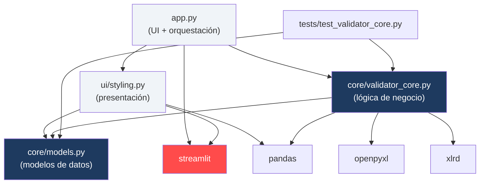
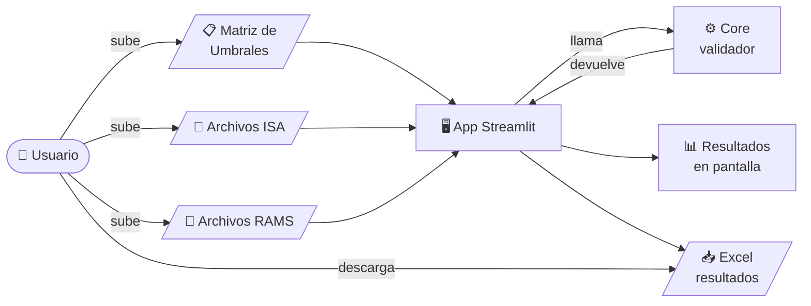
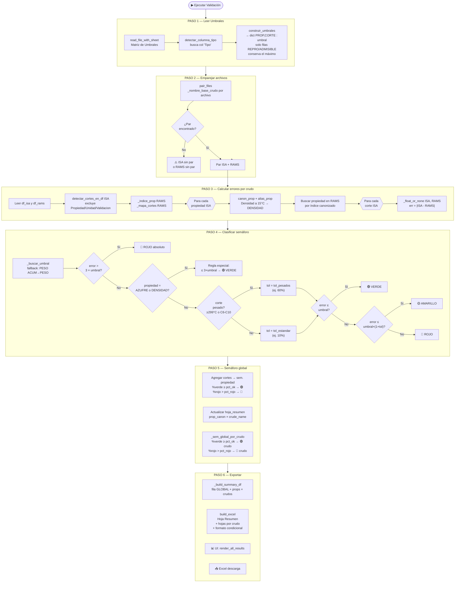
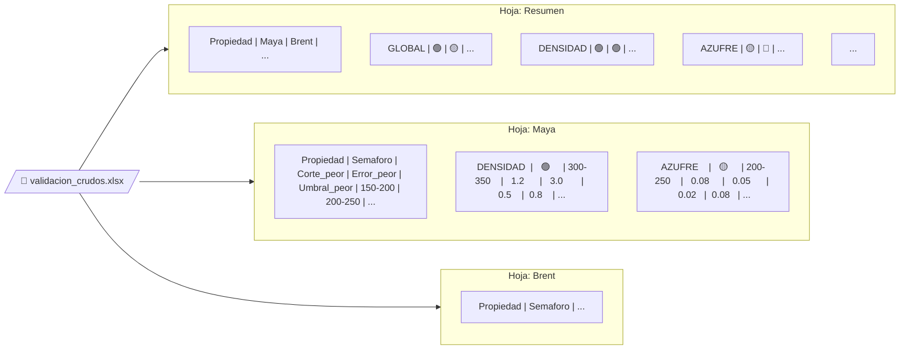
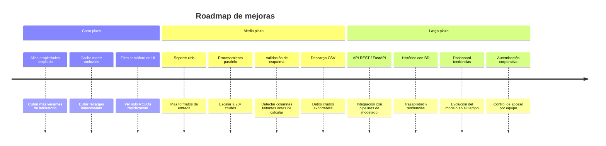

# 🛢️ Validador de Crudos RAMS vs ISA

> Herramienta web para validar predicciones de modelos **RAMS** contra mediciones de laboratorio **ISA**, calculando errores absolutos por propiedad y corte de destilación, clasificándolos con un sistema de semáforos configurable y exportando informes Excel listos para compartir — todo desde el navegador, sin instalar nada.

---

## Índice

1. [¿Qué es y qué problema resuelve?](#1-qué-es-y-qué-problema-resuelve)
2. [¿Qué hace exactamente?](#2-qué-hace-exactamente)
3. [Conceptos clave del dominio](#3-conceptos-clave-del-dominio)
4. [Arquitectura y estructura de archivos](#4-arquitectura-y-estructura-de-archivos)
5. [Dependencias](#5-dependencias)
6. [Cómo funciona: diagramas de flujo](#6-cómo-funciona-diagramas-de-flujo)
7. [Reglas de negocio detalladas](#7-reglas-de-negocio-detalladas)
8. [Cómo se usa: guía paso a paso](#8-cómo-se-usa-guía-paso-a-paso)
9. [Qué necesitas para usarlo](#9-qué-necesitas-para-usarlo)
10. [Formatos de archivo soportados](#10-formatos-de-archivo-soportados)
11. [Configuración](#11-configuración)
12. [Instalación y ejecución local](#12-instalación-y-ejecución-local)
13. [Despliegue en Streamlit Cloud](#13-despliegue-en-streamlit-cloud)
14. [Tests unitarios](#14-tests-unitarios)
15. [FAQ — Preguntas frecuentes](#15-faq--preguntas-frecuentes)
16. [Posibles mejoras y escalado](#16-posibles-mejoras-y-escalado)
17. [Licencia](#17-licencia)

---

## 1. ¿Qué es y qué problema resuelve?

Los equipos de modelado predictivo de crudos de petróleo producen predicciones de propiedades físico-químicas (**RAMS**) que deben contrastarse periódicamente contra las mediciones reales de laboratorio (**ISA**). Sin esta herramienta, esa comparación se hacía **manualmente en Excel**, archivo por archivo, propiedad por propiedad: un proceso lento, propenso a errores y difícil de reproducir o auditar.

El **Validador de Crudos RAMS/ISA** automatiza ese proceso de extremo a extremo:

| Sin la herramienta | Con la herramienta |
|---|---|
| Comparación manual en Excel, ~horas por crudo | Resultados en segundos para todos los crudos a la vez |
| Criterios de aceptación aplicados de forma inconsistente | Matriz de umbrales centralizada, aplicada igual siempre |
| Sin trazabilidad del corte más problemático | Identifica el peor corte y su error exacto por propiedad |
| Informe en formato libre, difícil de compartir | Excel estandarizado con formato condicional de color |

---

## 2. ¿Qué hace exactamente?

1. **Lee una Matriz de Umbrales** (archivo Excel corporativo) que define cuánto puede desviarse una predicción RAMS de la medición ISA antes de considerarse un error, para cada combinación de propiedad y corte de destilación.

2. **Empareja automáticamente** los archivos ISA y RAMS por nombre de crudo, tolerando distintas convenciones de nomenclatura (prefijos, sufijos, versiones, códigos estructurados).

3. **Calcula el error absoluto** `|ISA − RAMS|` para cada celda de la tabla (propiedad × corte).

4. **Clasifica cada propiedad** con un semáforo de tres colores según reglas de dominio específicas: tolerancias diferenciadas para cortes pesados, reglas especiales para Azufre y Densidad, y detección de errores graves (> 3× el umbral).

5. **Agrega el resultado** a nivel de crudo completo (semáforo global) y muestra el corte más crítico con su error y umbral.

6. **Genera un informe Excel** descargable con la misma estructura que el validador CLI original: hoja Resumen (propiedades × crudos, con fila GLOBAL) y una hoja por crudo con todas las métricas.

---

## 3. Conceptos clave del dominio

### Crudos y cortes de destilación

El petróleo crudo se analiza mediante **destilación fraccionada**: se separa en fracciones a distintos rangos de temperatura, llamadas **cortes**. Cada corte tiene propiedades físico-químicas propias.

```
IBP-150  →  Nafta ligera
150-200  →  Nafta pesada
200-250  →  Queroseno
250-300  →  Gasóleo ligero
300-350  →  Gasóleo medio
350+     →  Residuo (corte pesado)
C6-C10   →  Fracción de hidrocarburos ligeros (también pesado a efectos de tolerancia)
```

### Propiedades

Para cada corte se miden propiedades como: Densidad, Viscosidad (a 50°C y 100°C), Azufre, Punto de Vertido, Punto de Niebla, RON/MON, PIONA, Nitrógeno, Residuo de Carbón, Metales (Ni, V, Si), etc.

### Matriz de Umbrales

Archivo Excel corporativo (Errores_Cortes.xlsx o similar) que define el umbral de reproductibilidad para cada `(Propiedad, Corte)`. Si el modelo RAMS supera ese umbral, la predicción es inaceptable. Los umbrales provienen de normas analíticas (ASTM, IP, ISO).

### Sistema de Semáforos

| Color | Criterio | Acción sugerida |
|---|---|---|
| 🟢 **VERDE** | Error dentro del umbral (o regla especial para Azufre/Densidad) | Sin acción |
| 🟡 **AMARILLO** | Error ligeramente por encima del umbral (dentro de la tolerancia configurada) | Vigilar |
| 🔴 **ROJO** | Error fuera de la tolerancia, o dato faltante, o > 3× el umbral | Revisar el modelo |
| ⚪ **N/A** | No existe umbral definido para esa propiedad×corte | No aplica |

---

## 4. Arquitectura y estructura de archivos

### Principio de diseño: separación estricta por capas

```
┌──────────────────────────────────────────┐
│           CAPA UI  (Streamlit)           │
│   app.py  ·  ui/styling.py               │
│                                          │
│   • Recibe inputs del usuario            │
│   • Muestra resultados con colores       │
│   • Gestiona session_state               │
│   • ❌ NUNCA contiene lógica de negocio  │
└───────────────────┬──────────────────────┘
                    │ llama a
┌───────────────────▼──────────────────────┐
│        CAPA CORE  (Python puro)          │
│   core/validator_core.py                 │
│   core/models.py                         │
│                                          │
│   • Toda la lógica de validación         │
│   • ❌ NUNCA importa Streamlit           │
│   • ✅ 100% testeable en aislamiento     │
└──────────────────────────────────────────┘
```

### Estructura de archivos

```
validador-crudos-streamlit/
│
├── app.py                      ← Entrypoint Streamlit (UI + orquestación)
│
├── core/
│   ├── __init__.py
│   ├── models.py               ← Modelos de datos (ThresholdConfig, ValidationResult)
│   └── validator_core.py       ← Toda la lógica de negocio (~600 líneas)
│
├── ui/
│   ├── __init__.py
│   └── styling.py              ← Componentes de presentación Streamlit
│
├── tests/
│   ├── __init__.py
│   └── test_validator_core.py  ← ~60 tests unitarios del core
│
├── .streamlit/
│   ├── config.toml             ← Tema visual (colores, fuente)
│   └── secrets.toml            ← Valores por defecto (NO subir a Git)
│
├── conftest.py                 ← Configuración pytest (sys.path)
├── requirements.txt            ← Dependencias para Streamlit Cloud
└── README.md                   ← Este archivo
```

### Diagrama de dependencias entre módulos



---

## 5. Dependencias

### Producción (`requirements.txt`)

| Paquete | Versión mínima | Uso |
|---|---|---|
| `streamlit` | `>=1.32.0` | Framework web: interfaz, uploads, tablas, descarga |
| `pandas` | `>=2.1.0` | Manipulación de DataFrames, lectura de archivos |
| `openpyxl` | `>=3.1.0` | Lectura y escritura de `.xlsx` con estilos y formato condicional |
| `xlrd` | `>=2.0.1` | Lectura de archivos `.xls` (Excel 97-2003). ⚠️ No abre `.xlsx` |

> **Nota**: `matplotlib` **no es necesario**. El coloreado de celdas se hace directamente con CSS, sin gradientes que requieran matplotlib.

### Desarrollo (no van a Cloud)

| Paquete | Uso |
|---|---|
| `pytest` | Ejecutar la suite de tests unitarios |

### Regla por extensión de archivo Excel

```
.xlsx  →  engine: openpyxl   (Excel moderno, recomendado)
.xls   →  engine: xlrd       (Excel 97-2003; xlrd ≥ 2.0 NO lee .xlsx)
.csv   →  pandas             (auto-detecta separador: ; , \t |)
```

---

## 6. Cómo funciona: diagramas de flujo

### 6.1 Flujo de alto nivel



### 6.2 Pipeline detallado



### 6.3 Estructura del Excel de salida



---

## 7. Reglas de negocio detalladas

### 7.1 Emparejamiento de archivos

La función `_nombre_base_crudo()` extrae el nombre del crudo del nombre del archivo siguiendo este orden:

1. **Patrón estructurado** `XXX-AAAA-N` (ej. `GMX-2023-1`) — tiene prioridad
2. **Eliminar prefijo** `ISA_` / `RAMS_` al inicio
3. **Eliminar sufijo** `_ISA` / `_RAMS` (con versión opcional: `_ISA_v2`)

```
ISA_Maya.xlsx        →  Maya
RAMS_Maya.xlsx       →  Maya       ✅ par
ISA_COL-2024-3.xlsx  →  COL-2024-3
RAMS_COL-2024-3.xlsx →  COL-2024-3 ✅ par
Maya_ISA_v2.xlsx     →  Maya       ✅ par
ISA_Extra.xlsx       →  Extra      ⚠️ sin par
```

### 7.2 Lectura de la Matriz de Umbrales

- Se busca la columna `Propiedad` (case-insensitive)
- Se detecta la columna `Tipo` por nombre (`tipo`, `columna1`, `categoria`) o por contenido (busca celdas con `REPRO`, `ADMISIBLE`, `REPET`)
- **Solo se aceptan filas** cuyo Tipo contenga alguna de esas palabras
- Si para la misma `(Propiedad, Corte)` hay varias filas aceptadas, **se conserva el umbral mayor**
- Los nombres de propiedad y corte se normalizan (sin acentos, mayúsculas, guiones tipográficos)

### 7.3 Alias de propiedades

Más de 40 variantes de nombres se mapean a su forma canónica, por ejemplo:

| Nombre en archivo | Nombre canónico |
|---|---|
| `Densidad a 15°C` | `DENSIDAD` |
| `Densidad 15C` | `DENSIDAD` |
| `NOR Claro` | `RON` |
| `Viscosidad a 50C` | `VISCOSIDAD 50` |
| `Carbono Conradson` | `RESIDUO DE CARBON` |
| `PIONA (%vol), N-Parafinas` | `PIONA N-PARAFINAS` |

### 7.4 Clasificación de semáforo por corte

```
Para cada corte de cada propiedad:

  1. Sin valor numérico válido       → "(no numérico)" — no cuenta
  2. Sin umbral en la matriz         → "(sin umbral)" — no cuenta
  3. error > 3 × umbral              → 🔴 ROJO absoluto (flag especial)
  4. Propiedad = AZUFRE o DENSIDAD   → regla especial:
       - error ≤ 3 × umbral          → 🟢 VERDE
       - 2×umbral < error ≤ 3×umbral → 🟡 AMARILLO
  5. Corte pesado (≥ 299°C o C6-C10) → tolerancia = tol_pesados (default 60%)
     Corte normal                    → tolerancia = tol (default 10%)
       - error ≤ umbral              → 🟢 VERDE
       - error ≤ umbral × (1 + tol)  → 🟡 AMARILLO
       - error > umbral × (1 + tol)  → 🔴 ROJO
```

### 7.5 Semáforo global por propiedad

```
Si se activó "ROJO absoluto"        → 🔴 ROJO (independientemente del resto)
Si no hay ningún corte con umbral   → ⚪ N/A
Si % verdes ≥ pct_ok_amarillo       → 🟢 VERDE
Si % rojos > pct_rojo_rojo          → 🔴 ROJO
En cualquier otro caso              → 🟡 AMARILLO
```

### 7.6 Semáforo global por crudo

```
Agregando los semáforos de todas las propiedades del crudo:

Si % propiedades rojas  > pct_rojo_rojo   → 🔴 ROJO
Si % propiedades verdes ≥ pct_ok_amarillo → 🟢 VERDE
En cualquier otro caso                    → 🟡 AMARILLO
```

---

## 8. Cómo se usa: guía paso a paso

### Paso 1 — Preparar los archivos

Necesitas tres tipos de archivos:

**A) Matriz de Umbrales** (`Errores_Cortes.xlsx`): el archivo corporativo con los umbrales de reproductibilidad. Estructura mínima:

| Propiedad | Tipo | 150-200 | 200-250 | 300-350 | 350+ |
|---|---|---|---|---|---|
| DENSIDAD | Reproductibilidad | 2.0 | 2.5 | 3.0 | 3.5 |
| AZUFRE | Reproductibilidad | 0.05 | 0.10 | 0.20 | 0.40 |
| VISCOSIDAD 50 | Reproductibilidad | 1.0 | 1.5 | 2.0 | — |

**B) Archivos ISA** (mediciones de laboratorio): uno por crudo. Estructura mínima:

| Propiedad | 150-200 | 200-250 | 300-350 |
|---|---|---|---|
| Densidad | 850.5 | 860.2 | 875.0 |
| Viscosidad 50 | 5.2 | 8.1 | 15.3 |

**C) Archivos RAMS** (predicciones del modelo): uno por crudo, mismo esquema que ISA.

Convención de nombres recomendada:
```
ISA_NombreCrudo.xlsx   ↔   RAMS_NombreCrudo.xlsx
ISA_GMX-2024-1.xlsx    ↔   RAMS_GMX-2024-1.xlsx
```

### Paso 2 — Abrir la aplicación

- **Streamlit Cloud**: accede a la URL pública de tu app
- **Local**: `streamlit run app.py` → abre automáticamente en `http://localhost:8501`

### Paso 3 — Subir archivos en el sidebar

1. **Matriz de Umbrales** → uploader del sidebar (requerida)
2. Si la matriz tiene varias hojas, escribe el nombre en "Hoja de la matriz"
3. **Archivos ISA** → puedes subir varios a la vez
4. **Archivos RAMS** → puedes subir varios a la vez

### Paso 4 — Configurar parámetros

| Parámetro | Por defecto | Significado |
|---|---|---|
| Tolerancia estándar | `0.10` | Margen sobre el umbral para AMARILLO en cortes normales (10%) |
| Tolerancia cortes pesados | `0.60` | Margen ampliado para cortes ≥ 299°C o C6-C10 (60%) |
| % mín. VERDE global | `0.90` | Si ≥ 90% de propiedades son verdes → crudo VERDE |
| % máx. ROJO global | `0.30` | Si > 30% de propiedades son rojas → crudo ROJO |

### Paso 5 — Ejecutar

Pulsa **▶ Ejecutar Validación**. El botón está desactivado hasta que tengas los tres tipos de archivo cargados.

### Paso 6 — Interpretar resultados

**Tabla Resumen** (arriba en la pantalla):
- Primera fila = **GLOBAL** → semáforo del crudo completo
- Resto de filas = semáforo por propiedad × crudo
- Colores: 🟢 verde, 🟡 amarillo, 🔴 rojo

**Detalle por crudo** (expanders debajo):
- Tab **Semáforo**: Propiedad | Semáforo | Corte más crítico | Error en ese corte | Umbral aplicado
- Tab **Errores Absolutos**: valores numéricos `|ISA − RAMS|` por corte

### Paso 7 — Descargar el informe

Pulsa **📥 Descargar Informe Excel** para obtener el archivo `.xlsx` con formato condicional de color (verde/amarillo/rojo) que se activa al abrir en Excel o LibreOffice.

---

## 9. Qué necesitas para usarlo

### Para usar la app web (Streamlit Cloud)

- Navegador web moderno (Chrome, Firefox, Edge, Safari)
- Los tres tipos de archivo listos (Matriz de Umbrales + ISA + RAMS)
- URL de la app (te la proporciona quien la desplegó)

### Para desplegar en Streamlit Cloud

- Cuenta en [streamlit.io](https://streamlit.io)
- Repositorio en GitHub (público o privado) con este código
- Los archivos `app.py` y `requirements.txt` en la raíz del repo

### Para ejecutar en local

- Python 3.10 o superior
- Git
- Las dependencias del `requirements.txt` instaladas (ver [sección 12](#12-instalación-y-ejecución-local))

### Formato de los archivos de entrada

| Requisito | ISA / RAMS | Matriz de Umbrales |
|---|---|---|
| Extensión | `.xlsx`, `.xls`, `.csv` | `.xlsx`, `.xls`, `.csv` |
| Columna obligatoria | `Propiedad` | `Propiedad` + columna `Tipo` |
| Columnas de corte | Cualquier nombre (se normalizan) | Mismos nombres que ISA/RAMS |
| Filas de datos | Una por propiedad | Una o más por propiedad |

---

## 10. Formatos de archivo soportados

| Extensión | Engine | Notas |
|---|---|---|
| `.xlsx` | openpyxl | **Recomendado**. Excel moderno (2007+) |
| `.xls` | xlrd | Excel 97-2003. xlrd ≥ 2.0 **no** puede abrir `.xlsx` |
| `.csv` | pandas | Auto-detecta separador: `;` `,` `\t` `\|`. Soporta coma decimal española |

### Tolerancia en nombres de columnas de corte

El validador normaliza los nombres de corte automáticamente antes de compararlos, por lo que estas variantes se reconocen como el mismo corte:

| Variante en el archivo | Forma canónica |
|---|---|
| `150 - 200` | `150-200` |
| `150–200` (guión largo) | `150-200` |
| `150°-200°` | `150-200` |
| `538 +` | `538+` |
| `C6 - C10` | `C6-C10` |

---

## 11. Configuración

### Parámetros por defecto via `secrets.toml`

En `.streamlit/secrets.toml` puedes preconfigurar los valores por defecto de los parámetros para que la app arranque con los valores de tu organización:

```toml
[defaults]
tolerancia      = 0.10
tol_pesados     = 0.60
pct_ok_amarillo = 0.90
pct_rojo_rojo   = 0.30
```

El usuario puede cambiarlos en el sidebar en cada sesión; esto solo afecta al valor inicial que aparece al cargar la app.

### Tema visual (`.streamlit/config.toml`)

```toml
[theme]
primaryColor             = "#1E3A5F"   # azul corporativo (botones, sliders)
backgroundColor          = "#FFFFFF"   # fondo principal blanco
secondaryBackgroundColor = "#F0F4F8"   # fondo sidebar y expanders
textColor                = "#1A1A2E"   # texto principal
font                     = "sans serif"

[server]
maxUploadSize = 50          # MB máximo por archivo

[browser]
gatherUsageStats = false    # desactiva telemetría de Streamlit
```

### Añadir nuevos alias de propiedades

Si tus archivos usan variantes no reconocidas, añade entradas al diccionario en `core/validator_core.py`, función `crear_semantica_alias()`:

```python
raw = {
    # Ejemplo: añadir variante local
    "DENSIDAD RELATIVA 15/4": "DENSIDAD",
    "VISCOSIDAD CINEMATICA 40C": "VISCOSIDAD 40",
    ...
}
```

---

## 12. Instalación y ejecución local

```bash
# 1. Clonar el repositorio
git clone https://github.com/TU_USUARIO/validador-crudos-streamlit.git
cd validador-crudos-streamlit

# 2. Crear entorno virtual (recomendado)
python -m venv .venv
source .venv/bin/activate        # Linux/Mac
# .venv\Scripts\activate         # Windows

# 3. Instalar dependencias
pip install -r requirements.txt

# 4. Configurar secrets locales
cp .streamlit/secrets.toml.example .streamlit/secrets.toml
# Edita el archivo con tus valores preferidos

# 5. Ejecutar la app
streamlit run app.py
# → Abre automáticamente en http://localhost:8501
```

### Ejecutar tests

```bash
pytest tests/ -v

# Con cobertura (requiere pytest-cov):
pip install pytest-cov
pytest tests/ -v --cov=core --cov-report=term-missing
```

---

## 13. Despliegue en Streamlit Cloud

### Primera vez

1. Sube el código a un repositorio GitHub
2. Ve a [share.streamlit.io](https://share.streamlit.io) e inicia sesión con GitHub
3. Clic en **New app** → selecciona el repo, rama `main`, archivo `app.py`
4. En **Advanced settings → Secrets**, pega el contenido de tu `secrets.toml`
5. Clic en **Deploy** → la URL pública queda activa en 1-2 minutos

### Actualizar la app

```bash
git add .
git commit -m "feat: descripción del cambio"
git push origin main
# Streamlit Cloud detecta el push y redespliega automáticamente
```

### Consideraciones de memoria

Streamlit Community tiene ~1 GB de RAM. Los archivos Excel de laboratorio son pequeños (KB–pocos MB) — no hay problema en uso normal. Si los archivos fueran grandes (>10 MB cada uno, decenas de crudos), considera la versión Teams/Pro.

---

## 14. Tests unitarios

La suite cubre ~60 tests organizados en 16 clases:

| Clase de test | Qué verifica |
|---|---|
| `TestStripAccents` | Normalización de acentos Unicode |
| `TestCanonProp` | Canonización de propiedades con alias del dominio |
| `TestCanonCorte` | Normalización de guiones, grados, espacios |
| `TestEsCorteePesado` | Detección cortes pesados: ≥299°C, C6-C10, límite exacto 298/299 |
| `TestNombreBaseCrudo` | Emparejamiento: prefijos, sufijos, versiones, códigos estructurados |
| `TestPairFiles` | Emparejamiento ISA↔RAMS completo, sin par, código estructurado |
| `TestReadFile` | Lectura xlsx, csv (`;`/`,`), extensión no soportada, archivo corrupto |
| `TestConstruirUmbrales` | Construcción desde matriz, max gana, solo REPRO/ADMISIBLE |
| `TestClasificarPropiedad` | Todas las reglas: verde/amarillo/rojo, rojo absoluto, regla Azufre, PESO ACUMULADO |
| `TestSemGlobalPorCrudo` | Agregación: todo verde, mayoría rojos, caso mixto amarillo |
| `TestCalcularErroresCrudoDf` | Pipeline por crudo: columnas correctas, errores absolutos, resumen poblado |
| `TestValidateParams` | Validación: tolerancias negativas, porcentajes fuera de rango |
| `TestBuildSummaryDf` | Estructura: fila GLOBAL primera, todas las propiedades, columnas por crudo |
| `TestBuildExcelMVP` | Excel: hojas correctas, fila GLOBAL en Resumen, columna Semaforo |
| `TestRunValidation` | Pipeline completo end-to-end con matriz de umbrales real |
| `TestBackwardsCompat` | Stubs de compatibilidad, constantes exportadas |

---

## 15. FAQ — Preguntas frecuentes

### ❓ "No se encontraron pares ISA/RAMS"

El validador no pudo emparejar ningún archivo. Causas más comunes:

- Los nombres base no coinciden después de eliminar los prefijos/sufijos ISA/RAMS
- Usa la convención: `ISA_NombreCrudo.xlsx` ↔ `RAMS_NombreCrudo.xlsx`
- O el patrón estructurado: `GMX-2024-1_ISA.xlsx` ↔ `GMX-2024-1_RAMS.xlsx`

### ❓ "La matriz de umbrales no tiene columna 'Propiedad'"

La primera columna de la matriz debe llamarse exactamente `Propiedad` (con mayúscula, sin tilde).

### ❓ "No se localiza columna 'Tipo'"

El validador busca la columna de tipo por nombre (`Tipo`, `Columna1`, `Categoria`) y también por contenido (busca celdas con `REPRO`, `ADMISIBLE`, `REPET`). Asegúrate de que esa columna existe y sus valores contienen alguna de esas palabras.

### ❓ Todas las propiedades salen como ⚪ N/A

Los nombres de propiedades en ISA/RAMS no coinciden con los de la Matriz de Umbrales tras la normalización. Comprueba que los nombres sean reconocibles (ver tabla de aliases en [sección 7.3](#73-alias-de-propiedades)) o añade el alias que falte.

### ❓ Los semáforos del Excel no muestran color

El formato condicional es dinámico: Excel lo evalúa al abrir el archivo. Abre el `.xlsx` en **Microsoft Excel** o **LibreOffice Calc**. Si usas Google Sheets, importa el archivo (Archivo → Importar) — el formato condicional se activará.

### ❓ Un archivo ISA no tiene los mismos cortes que RAMS

No es un problema. El validador toma **únicamente los cortes presentes en ISA** (ISA es la referencia). Si RAMS no tiene un corte de ISA, ese corte aparece como `None` (N/D) en el informe.

### ❓ Los archivos desaparecen al mover un slider en el sidebar

La app usa `st.session_state` para persistir los archivos entre reruns. Si experimentas este problema, actualiza a la versión más reciente del código.

### ❓ Error: "background_gradient requires matplotlib"

Este error ocurre si usas una versión anterior del código. La versión actual **no usa matplotlib**; el coloreado se hace directamente con CSS. Actualiza `ui/styling.py`.

### ❓ ¿Puedo validar varios crudos a la vez?

Sí. Sube todos los ISA en el uploader ISA y todos los RAMS en el uploader RAMS en una sola sesión. El validador los empareja y procesa todos simultáneamente.

### ❓ ¿Los datos que subo se guardan en algún servidor?

No. Todo el procesamiento ocurre en memoria (BytesIO) durante tu sesión. Los archivos no se escriben a disco y no se almacenan más allá de la sesión activa.

---

## 16. Posibles mejoras y escalado

### Flexibilidad inmediata (bajo esfuerzo)

| Mejora | Descripción |
|---|---|
| **Más aliases de propiedades** | Añadir entradas al diccionario en `crear_semantica_alias()` para cubrir nombres de laboratorios específicos |
| **Hoja de la matriz por defecto** | Configurar en `secrets.toml` qué hoja usar si la matriz tiene varias |
| **Descarga directa de datos CSV** | Añadir un `st.download_button` con los DataFrames de errores como CSV además del Excel |
| **Filtro de semáforo** | Permitir al usuario ver solo los crudos/propiedades con semáforo ROJO |
| **Umbral `pct_rojo_rojo` por propiedad** | Configurar umbrales de agregación distintos para propiedades críticas (ej. Azufre más estricto) |

### Escalado técnico (esfuerzo medio)

| Mejora | Descripción |
|---|---|
| **Caché de la Matriz de Umbrales** | Usar `@st.cache_data` en la lectura de la matriz para que no se recargue en cada rerun; invalida si cambia el archivo |
| **Procesamiento paralelo** | Si hay muchos crudos (>20), procesar pares en paralelo con `concurrent.futures.ThreadPoolExecutor` |
| **Progreso por crudo** | Actualizar `st.progress()` conforme se procesa cada crudo, en lugar de un único progreso en 3 pasos |
| **Soporte `.xlsb`** | Añadir `pyxlsb` a `requirements.txt` y registrar el engine en `read_file()` para archivos Excel binarios |
| **Validación de esquema** | Antes del cálculo, verificar que ISA y RAMS tienen las mismas propiedades y advertir si faltan columnas importantes |
| **Modo comparación múltiple** | Comparar N versiones de RAMS contra el mismo ISA (tracking de mejora del modelo a lo largo del tiempo) |

### Escalado funcional (esfuerzo alto)

| Mejora | Descripción |
|---|---|
| **Base de datos histórica** | Guardar resultados por fecha en SQLite o PostgreSQL para trazabilidad y tendencias |
| **API REST** | Exponer el core como FastAPI para integración con pipelines CI/CD del equipo de modelado |
| **Dashboard de tendencias** | Gráficas de evolución del semáforo por crudo y propiedad a lo largo de múltiples validaciones |
| **Autenticación** | Integrar con Streamlit Community Cloud Auth o un IdP corporativo (Azure AD, Okta) |
| **Notificaciones** | Enviar email/Teams cuando un crudo nuevo pasa a ROJO global |
| **Matriz de umbrales editable en UI** | Permitir ajustar umbrales directamente en la app y guardarlos (requiere backend de persistencia) |
| **Soporte multiidioma** | Internacionalizar UI para equipos en inglés, portugués, francés |

### Diagrama de evolución sugerida



---

## 17. Licencia

```
Copyright © 2024-2026. Todos los derechos reservados.

Todo el código fuente, documentación y archivos contenidos en este repositorio
son propiedad exclusiva de su autor.

Queda PROHIBIDO sin autorización expresa por escrito:
  - Copiar, distribuir o modificar este software
  - Usar este software con fines comerciales o no comerciales
  - Usar el código para entrenar modelos de inteligencia artificial

La visibilidad del repositorio NO otorga ningún derecho de uso, reproducción ni derivación.
```

---

*Última actualización: febrero 2026*
